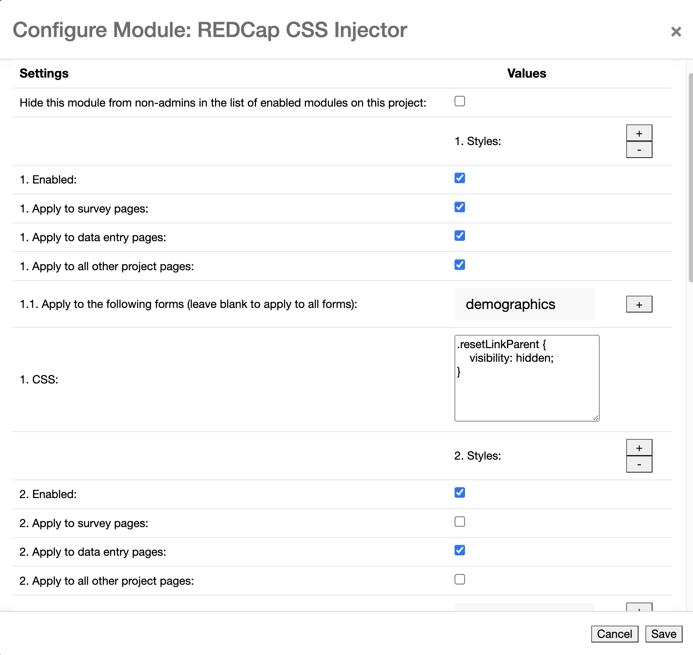

# REDCap CSS Injector
Allows administrators to inject CSS into survey pages, data entry pages, and every other project page.

[](https://zenodo.org/badge/latestdoi/141312467)

> **Important:** Version 2.0.0 of this module is a breaking change. If you are upgrading from a version prior to 2.0.0, please review this [section](#migration-from-version-1xx-to-200)  of the README for changes to the configuration. If you are new to this module, you can ignore this section.

## Prerequisites
- REDCap >= 8.0.3

## Easy Installation
- Obtain this module from the Consortium [REDCap Repo](https://redcap.vanderbilt.edu/consortium/modules/index.php) from the Control Center.


## Manual Installation
- Clone this repo into `<redcap-root>/modules/redcap_css_injector_v<version_number>` .
- Go to **Control Center > Manage External Modules** and enable REDCap CSS Injector.

## Configuration
Access **Manage External Modules** section of your project, and then click on CSS Injector configuration button.

In the configuration form, you can either create a global style for your project or define multiple styles for different contexts. Each context is defined by choosing a list of forms/instruments and/or limiting the scope to surveys or data entries or other pages in the project. You can also define a style for all pages in the project by selecting all three checkboxes.

The configuration form also provides an enable/disable switch for each one of your styles. Make sure to enable your styles.

If more than one style is applied to the same page, the CSS rules are applied in the order of appearance in the configuration form.




## Migration from version 1.X.X to 2.0.0

If you are upgrading from a version prior to 2.0.0, you will need to reconfigure your styles. To make this easier, we have a MySQL query that will help you migrate your current styles to the new configuration format. Your administrator will need to run this query on the REDCap database.


```sql
START TRANSACTION;

CREATE UNIQUE INDEX redcap_external_module_settings_UK1
on redcap_external_module_settings (external_module_id, project_id, `key`);

INSERT INTO redcap_external_module_settings (external_module_id, project_id, `key`, type, value)
SELECT 
    s.external_module_id,
    s.project_id,
    k.`key`,
    'json-array',
    (
        SELECT 
            JSON_ARRAYAGG(
                CASE
                    WHEN JSON_UNQUOTE(JSON_EXTRACT(s2.value, CONCAT('$[', jt.idx - 1, ']'))) = 'all' THEN CAST(TRUE AS JSON)
                    WHEN JSON_UNQUOTE(JSON_EXTRACT(s2.value, CONCAT('$[', jt.idx - 1, ']'))) = k.`key` THEN CAST(TRUE AS JSON)
                    ELSE CAST(FALSE AS JSON)
                END
            )
        FROM 
            redcap_external_module_settings s2
        CROSS JOIN JSON_TABLE(
            s2.value,
            '$[*]' COLUMNS(
                idx FOR ORDINALITY
            )
        ) AS jt
        WHERE 
            s2.external_module_id = s.external_module_id
            AND s2.project_id = s.project_id
            AND s2.`key` = 'style_type' 
    ) AS new_value
FROM 
    redcap_external_module_settings s
CROSS JOIN (
    SELECT 'survey' AS `key`
    UNION ALL 
    SELECT 'data_entry' AS `key`
    UNION ALL 
    SELECT 'other' AS `key`
) k
WHERE 
    s.`key` = 'style_type'
    AND s.external_module_id IN (
        SELECT external_module_id
        FROM redcap_external_modules
        WHERE directory_prefix = 'redcap_css_injector'
    )
GROUP BY 
    s.external_module_id, 
    s.project_id, 
    k.`key`;

DROP INDEX redcap_external_module_settings_UK1 on redcap_external_module_settings;

COMMIT;
```

> **Note:**
This query requires MySQL 8.0 or later. 

If you run this query shortly before upgrading CSS Injector, the migrated settings will be in place for the module upgrade. The module will start working correctly immediately. You can run the script after the module upgrade, but the module will have no effect until you either run the settings migration script or set the _Apply to survey pages / data entry pages / other project pages_ checkboxes manually.

The query should be run in against the MySQL database of your REDCap instance. After running the query, you should see a message saying that some rows were inserted. The module will start working immediately. In the project home page go to the **External Module > Manage** and click on the REDCap CSS Injector configure button. You should see your styles migrated to the new configuration format.

## Sample CSS

For CSS ideas you could try in CSS injector see the [sample CSS files](samples/). These files were tested against surveys in REDCap 8.7.0. Please verify they work as desired in your REDCap before using them in production. Each is dependent on REDCap's style names. As those style names can change over time, they probably won't hold value forever.

## Writing CSS for the CSS Injector

To learn how to craft your own CSS for use in REDCap CSS Injector, you'll need to use the developer tools for your web browser. Chrome supports the [Chrome DevTools](https://developers.google.com/web/tools/chrome-devtools/).  Firefox supports [Firefox Developer Tools](https://developer.mozilla.org/en-US/docs/Tools).  Using one of these tools you can access a REDCap page and inspect an element of the page you want to change. The dev tools allow you to see what CSS controls an element's appearance. You can change the values you think might give you the effect you want and review the result in real time on that page.  Once you get the result you like, copy that CSS, trim it down to the part you care about, and test it in CSS inspector.
