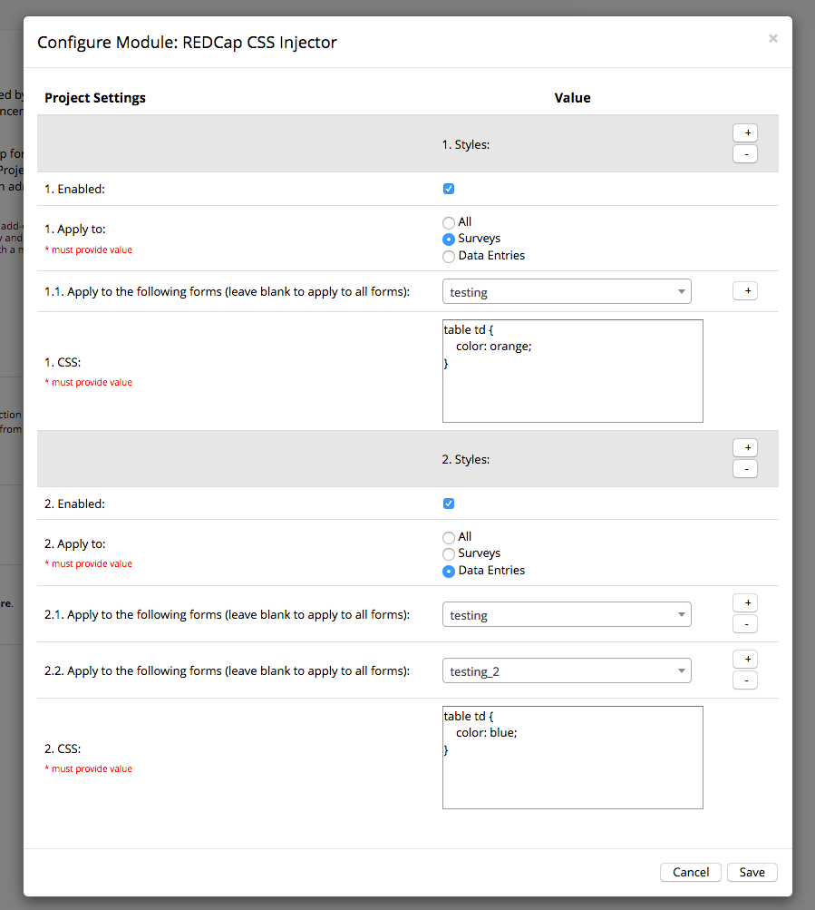

# REDCap CSS Injector
Allows administrators to inject CSS into surveys and data entry forms.

## Prerequisites
- REDCap >= 8.4.3

## Easy Installation
- Obtain this module from the Consortium [REDCap Repo] (https://redcap.vanderbilt.edu/consortium/modules/index.php) from the Control Center.

## Manual Installation
- Clone this repo into `<redcap-root>/modules/redcap_css_injector_v<version_number>` .
- Go to **Control Center > Manage External Modules** and enable REDCap CSS Injector.

## Configuration
Access **Manage External Modules** section of your project, and then click on CSS Injector configuration button.

In the configuration form, you can either create a global style for your project or define multiple styles for different contexts. Each context is defined by choosing a list of forms/instruments and/or limiting the scope to surveys or data entries.

The configuration also provides an enable/disable flag for each one of your styles.

